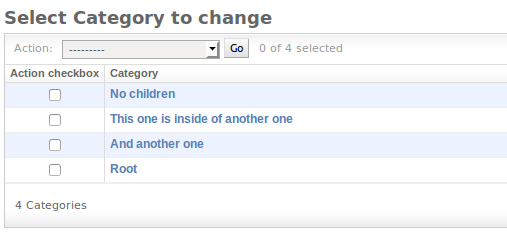
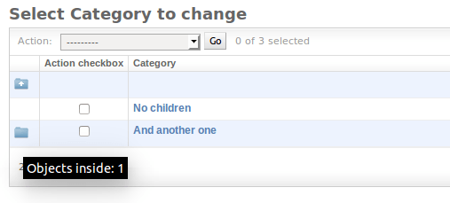

Quickstart
==========

.. note::

    Make sure ``admirarchy`` is listed in INSTALLED_APPS in settings file of your project (usually 'settings.py').

With a few minor changes...

.. code-block:: python

    # admin.py of your application
    from django.contrib import admin

    from admirarchy.toolbox import HierarchicalModelAdmin

    from .models import MyModel  # Let's say this model represents a hierarchy.

    # Inherit from HierarchicalModelAdmin instead of admin.ModelAdmin
    @admin.register(MyModel)
    class MyModelAdmin(HierarchicalModelAdmin):

        hierarchy = True  # This enables hierarchy handling.

        # and other code as usual...

...your admin...

...turns into something similar to this:

